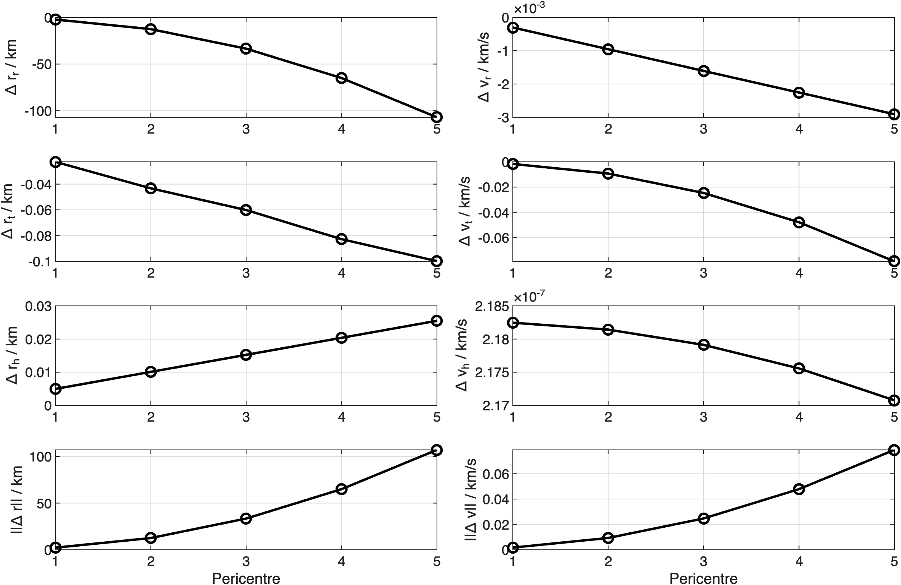
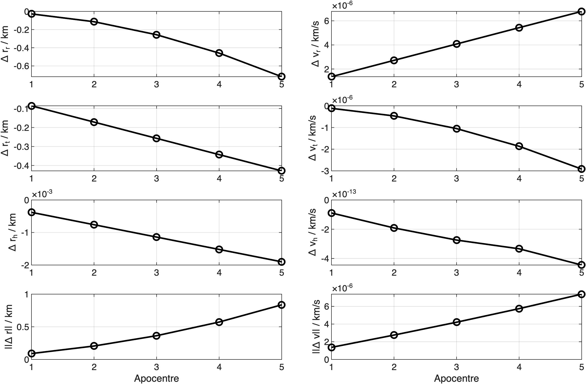
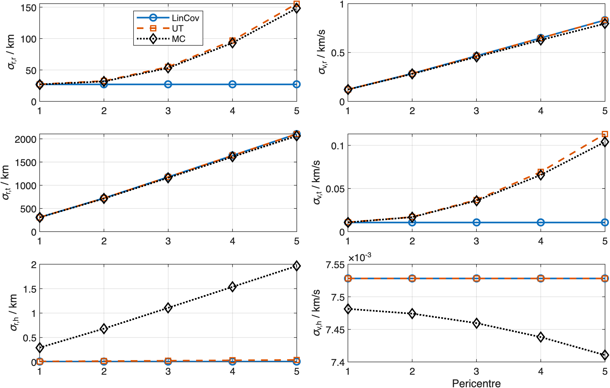
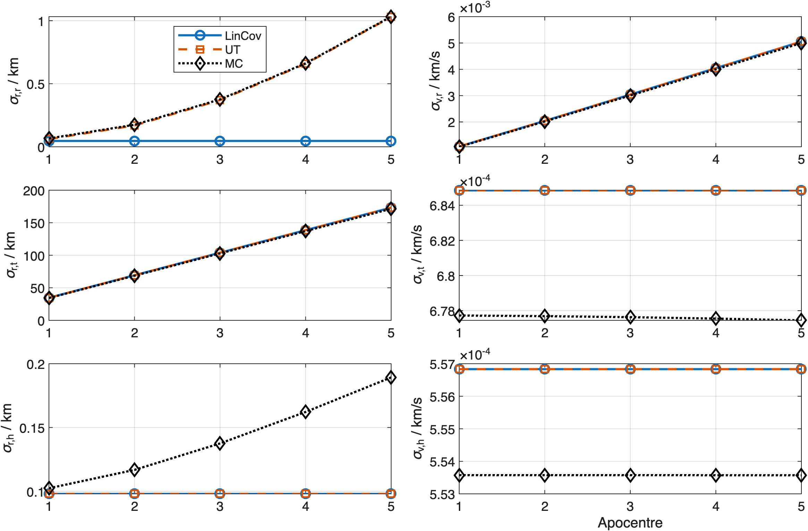
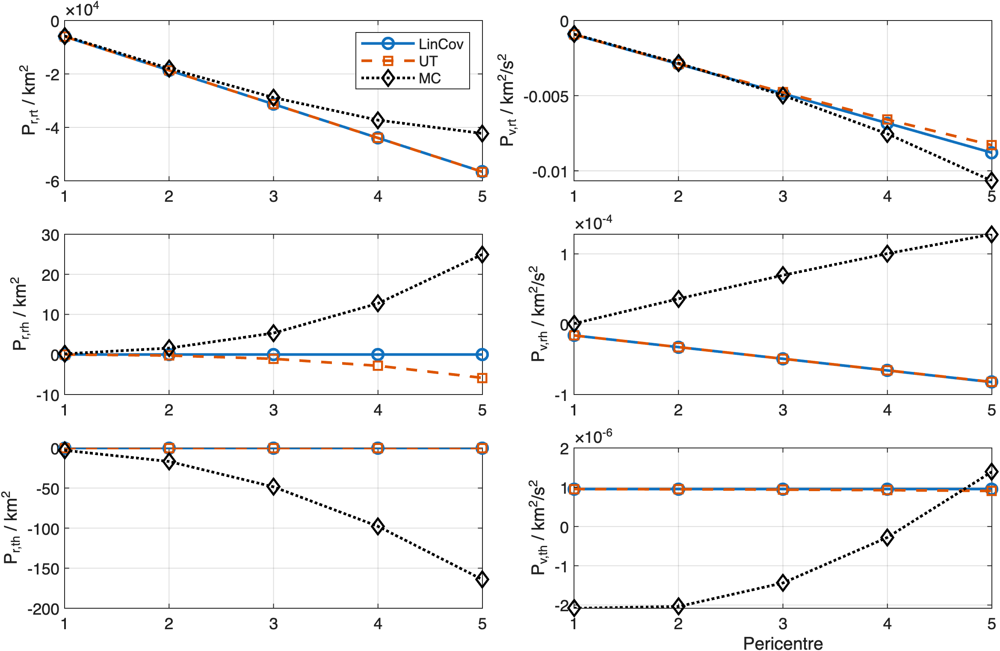
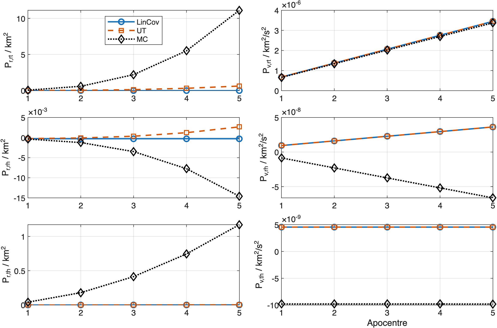
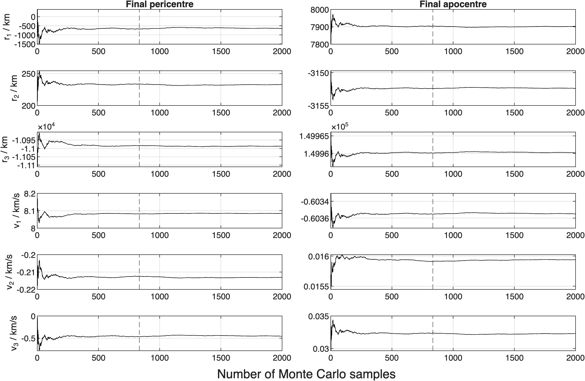
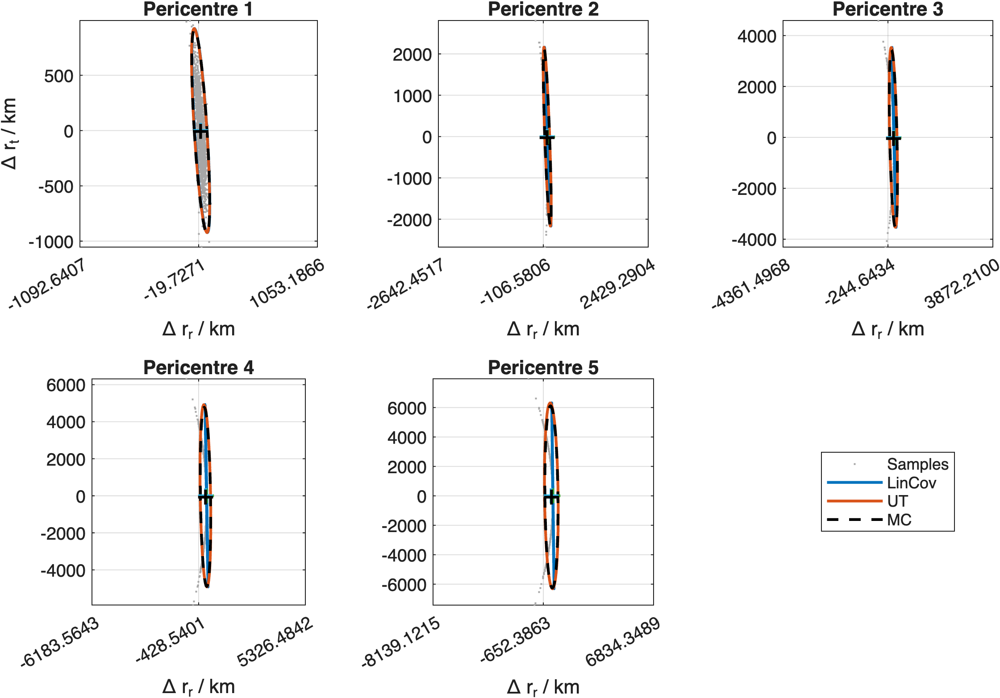
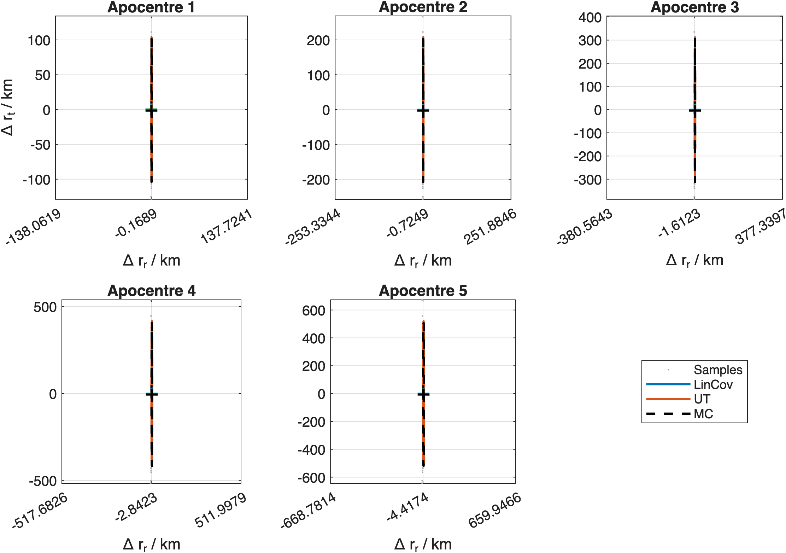
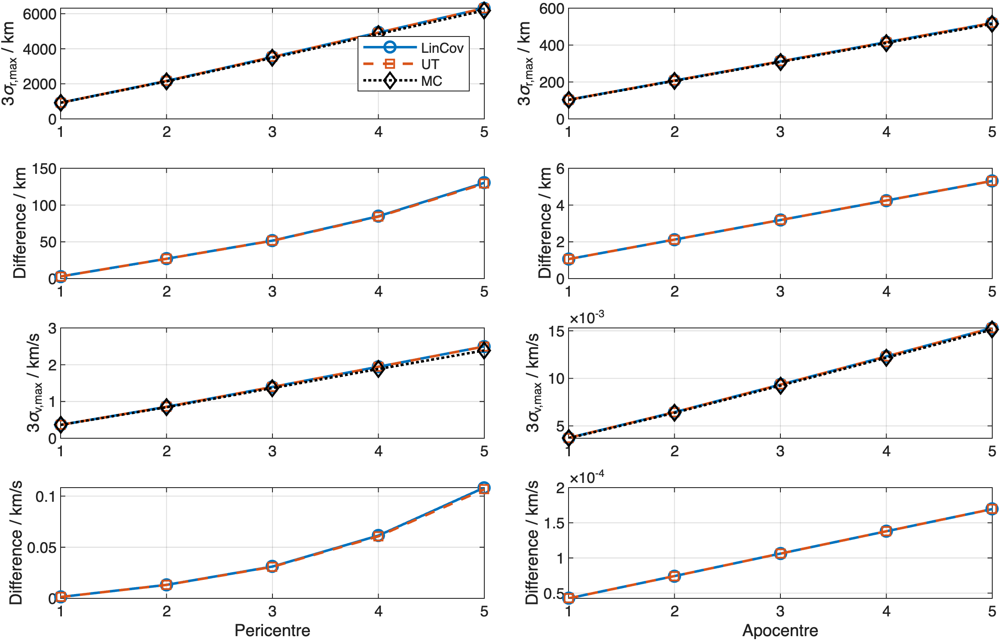

# INTEGRAL Orbital Uncertainty Propagation

**Author:** Pasquale Marzaioli

Comparison of linearized covariance (LinCov), the scaled unscented transform (UT), and Monte Carlo sampling for an INTEGRAL-inspired uncertainty-propagation benchmark under two-body Earth gravity. Uncertainties are mapped over five orbital revolutions, evaluated at fixed nominal pericentre and apocentre epochs, and expressed in the local radial–transverse–normal (RTH) frame.

This is a numerical-method benchmark, not an operational orbit prediction. The repository does not contain provenance for the supplied state and covariance, so they must be treated as illustrative inputs rather than a documented flight orbit-determination solution.

Audited numerical tables and diagnostics from a verified run are collected in [`results.md`](results.md). Figures are stored in [`plots/`](plots/).

---

## 1. Motivation

Orbit determination and prediction require not only a nominal trajectory but also a faithful representation of how initial uncertainty evolves under the dynamics. For near-circular low Earth orbits a linear mapping through the state-transition matrix is often adequate. This benchmark is highly eccentric: the radial distance ranges from roughly $1.1\times 10^{4}\,\mathrm{km}$ at pericentre to $1.5\times 10^{5}\,\mathrm{km}$ at apocentre. Over such an arc the gravitational acceleration varies by more than two orders of magnitude, and nonlinear effects in the flow map accumulate.

This repository therefore asks a concrete question:

> Given a six-dimensional Gaussian initial uncertainty at a known apocentre epoch, how do linearized covariance propagation, a deterministic sigma-point (unscented) transform, and a large Monte Carlo ensemble compare when the uncertainty is transported to the next five pericentres and apocentres?

Monte Carlo is a finite-sample numerical reference here, not ground truth. Large, systematic discrepancies identify nonlinear effects; small differences must be interpreted against Monte Carlo sampling error.

---

## 2. Physical model

### 2.1 Two-body dynamics

The state is expressed in an Earth-centred inertial (ECI) Cartesian frame. The source orientation of the supplied components is not documented. Because this isotropic two-body benchmark is rotationally invariant, that missing orientation does not affect the scalar diagnostics or the local RTH histories.

$$\mathbf{x} = \begin{bmatrix} \mathbf{r} \\ \mathbf{v} \end{bmatrix} \in \mathbb{R}^{6},$$

with position $\mathbf{r}$ in $\mathrm{km}$ and velocity $\mathbf{v}$ in $\mathrm{km}/\mathrm{s}$. Point-mass Earth gravity with gravitational parameter

$$\mu = 398600.4418\,\mathrm{km}^{3}/\mathrm{s}^{2}$$

gives the first-order system

$$\dot{\mathbf{r}} = \mathbf{v}, \qquad \dot{\mathbf{v}} = -\mu\,\frac{\mathbf{r}}{\|\mathbf{r}\|^{3}}.$$

No $J_{2}$, atmospheric drag, solar-radiation pressure, lunar/solar gravity, relativity, or manoeuvres are included. The study deliberately isolates Keplerian nonlinearity; it is unsuitable for flight-accuracy prediction over the roughly 13-day analysis interval.

### 2.2 Conserved specific energy

The specific orbital energy

$$\varepsilon = \frac{\|\mathbf{v}\|^{2}}{2} - \frac{\mu}{\|\mathbf{r}\|}$$

is constant along each exact Keplerian trajectory. The integrator is required to conserve $\varepsilon$ to a relative tolerance of $10^{-10}$ at every detected apsis (see §8).

### 2.3 Orbital period

From the initial state one obtains the semimajor axis

$$a = \left(\frac{2}{\|\mathbf{r}_{0}\|} - \frac{\|\mathbf{v}_{0}\|^{2}}{\mu}\right)^{-1}$$

and the Keplerian period

$$T = 2\pi\sqrt{\frac{a^{3}}{\mu}}.$$

For the benchmark initial conditions used here,

$$T = 227964.078\,\mathrm{s} \approx 63.323\,\mathrm{h}.$$

The corresponding analytic elements and apsis radii are

$$a = 80656.052\,\mathrm{km}, \qquad e = 0.8622545,$$

$$r_p = a(1-e) = 11110.010\,\mathrm{km}, \qquad r_a = a(1+e) = 150202.093\,\mathrm{km}.$$

---

## 3. Apsis detection

An apsis is a turning point of the radial distance, equivalently a root of the radial-rate condition

$$\mathbf{r}\cdot\mathbf{v} = 0.$$

This condition is registered as an `ode113` event while integrating the nominal trajectory over a horizon slightly longer than five periods. Events occurring at the supplied initial apocentre ($t\approx 0$) are discarded. Remaining roots are classified by the sign of

$$\frac{\mathrm{d}}{\mathrm{d}t}(\mathbf{r}\cdot\mathbf{v}) = \|\mathbf{v}\|^{2} - \frac{\mu}{\|\mathbf{r}\|}:$$

- positive $\Rightarrow$ **pericentre** (radial distance increasing after the root),
- negative $\Rightarrow$ **apocentre**.

The first five events of each type become the analysis epochs. Their Cartesian states and UTC times are listed in [`results.md`](results.md). Every sigma point and Monte Carlo realization is evaluated at these same nominal event times; sample-specific apsides are not detected.

---

## 4. Uncertainty representations

The initial estimate is Gaussian,

$$\mathbf{x}_{0} \sim \mathcal{N}(\bar{\mathbf{x}}_{0},\, P_{0}),$$

with $\bar{\mathbf{x}}_{0}$ and $P_{0}$ given in §7. Three mappings to a later time $t$ are computed independently.

### 4.1 Linearized covariance (LinCov)

Let $\boldsymbol{\Phi}(t,t_{0})$ be the state-transition matrix (STM) of the variational equation about the nominal trajectory. Writing $\Phi(t)=\Phi(t,t_{0})$ for brevity,

$$\dot{\Phi} = A(t)\,\Phi, \qquad \Phi(t_{0}) = I_{6},$$

where the $6\times 6$ Jacobian of the two-body vector field is

$$A = \begin{bmatrix} 0_{3\times 3} & I_{3} \\ G(\mathbf{r}) & 0_{3\times 3} \end{bmatrix},$$

$$G(\mathbf{r}) = \mu\left(\frac{3\,\mathbf{r}\mathbf{r}^{\top}}{\|\mathbf{r}\|^{5}} - \frac{I_{3}}{\|\mathbf{r}\|^{3}}\right).$$

The matrix $G$ is the gravity-gradient (tidal) tensor of the central force. Propagating the augmented state $[\mathbf{x};\,\mathrm{vec}(\Phi)]$ with the same integrator yields $\Phi$ at every apsis. Under the linear map,

$$P_{\mathrm{Lin}}(t) = \Phi(t)\, P_{0}\, \Phi(t)^{\top}, \qquad \bar{\mathbf{x}}_{\mathrm{Lin}}(t) = \mathbf{x}_{\mathrm{nom}}(t).$$

LinCov is exact only for linear dynamics; here it is the first-order approximation of the nonlinear flow.

### 4.2 Unscented transform (UT)

The scaled sigma-point set for dimension $n=6$ uses

$$\lambda = \alpha^{2}(n+\kappa)-n, \qquad \alpha=0.1,\;\beta=2,\;\kappa=0.$$

With $S$ the lower Cholesky factor of $(n+\lambda)P_{0}$, the $2n+1=13$ sigma points are

$$\boldsymbol{\mathcal{X}}^{(0)} = \bar{\mathbf{x}}_{0}, \qquad \boldsymbol{\mathcal{X}}^{(i)} = \bar{\mathbf{x}}_{0} + \mathbf{s}_{i}, \qquad \boldsymbol{\mathcal{X}}^{(i+n)} = \bar{\mathbf{x}}_{0} - \mathbf{s}_{i}, \quad i=1,\ldots,n,$$

where $\mathbf{s}_{i}$ denotes the $i$-th column of $S$. Each point is integrated nonlinearly to time $t$. The predicted mean and covariance are the weighted statistics

$$\bar{\mathbf{x}}_{\mathrm{UT}} = \sum_{i=0}^{2n} w_{i}^{(m)}\,\boldsymbol{\mathcal{Y}}^{(i)},$$

$$P_{\mathrm{UT}} = \sum_{i=0}^{2n} w_{i}^{(c)}\bigl(\boldsymbol{\mathcal{Y}}^{(i)}-\bar{\mathbf{x}}_{\mathrm{UT}}\bigr)\bigl(\boldsymbol{\mathcal{Y}}^{(i)}-\bar{\mathbf{x}}_{\mathrm{UT}}\bigr)^{\top},$$

with the standard scaled mean and covariance weights $w_{i}^{(m)}$, $w_{i}^{(c)}$. The scaled UT is second-order accurate in the predicted mean and covariance. For Gaussian inputs, $\beta=2$ incorporates part of the fourth-order covariance information. Its deterministic $13$ trajectories are much cheaper than Monte Carlo, but the negative central weights produced by these parameters ($w_0^{(m)}=-99$, $w_0^{(c)}=-96.01$) require numerical checks; the script verifies reconstruction of the supplied mean and covariance before propagation.

### 4.3 Monte Carlo and stability diagnostic

Draw $N_{\mathrm{MC}}=2000$ independent samples

$$\mathbf{x}_{0}^{(k)} = \bar{\mathbf{x}}_{0} + L\,\boldsymbol{\xi}^{(k)}, \qquad \boldsymbol{\xi}^{(k)}\sim\mathcal{N}(\mathbf{0},I_{6}),$$

where $L$ is the lower Cholesky factor of $P_{0}$ and the generator is seeded with $42$ for reproducibility. Propagate each sample to every apsis time. The sample mean and unbiased sample covariance define $P_{\mathrm{MC}}$ and $\bar{\mathbf{x}}_{\mathrm{MC}}$.

**Retrospective stability diagnostic.** At the last pericentre and last apocentre, form the cumulative mean $\bar{\mathbf{x}}_{N}$ for $N=1,\ldots,N_{\mathrm{MC}}$. Let $\sigma_{j}$ be the full-sample standard deviation of component $j$. The reported $N_{\min}$ is the smallest sample count after which every cumulative mean remains within $0.05\,\sigma_j$ of the same run's final mean, simultaneously for both apsides. The run reported here yields

$$N_{\min} = 834 \quad\text{at}\quad 0.050\,\sigma.$$

This is a descriptive within-run stability measure, not an independent convergence proof: because the final sample mean is the reference, the condition necessarily holds at $N=N_{\mathrm{MC}}$. For scale, a Gaussian sample variance based on $2000$ independent draws has an approximate relative standard error $\sqrt{2/(N-1)}=3.16\%$.

---

## 5. Radial–transverse–normal (RTH) frame

At a reference state $(\mathbf{r},\mathbf{v})$ the local orbit triad is

$$\hat{\mathbf{r}} = \frac{\mathbf{r}}{\|\mathbf{r}\|}, \qquad \hat{\mathbf{h}} = \frac{\mathbf{r}\times\mathbf{v}}{\|\mathbf{r}\times\mathbf{v}\|}, \qquad \hat{\mathbf{t}} = \hat{\mathbf{h}}\times\hat{\mathbf{r}}.$$

The $3\times 3$ rotation $R$ with rows $[\hat{\mathbf{r}}^{\top};\,\hat{\mathbf{t}}^{\top};\,\hat{\mathbf{h}}^{\top}]$ maps ECI vector components into radial, transverse (along-track), and normal (cross-track) components. Position and velocity blocks transform together through

$$T = \mathrm{blkdiag}(R,R), \qquad P_{\mathrm{RTH}} = T\, P_{\mathrm{ECI}}\, T^{\top}.$$

Mean differences (for example $\bar{\mathbf{x}}_{\mathrm{UT}}-\bar{\mathbf{x}}_{\mathrm{Lin}}$) are rotated by the same $T$. Working in RTH separates radial stretching from along-track phase error and out-of-plane tilt—coordinates natural for orbit analysis.

---

## 6. Numerical integration

All trajectories use MATLAB’s variable-order Adams–Bashforth–Moulton solver `ode113` with

$$\mathrm{RelTol} = 10^{-12}, \qquad \mathrm{AbsTol} = 10^{-13}.$$

The same options apply to the variational (STM) integration and to every sigma-point or Monte Carlo sample, so there is no deliberate solver inconsistency between methods. Monte Carlo results additionally contain finite-sample noise.

---

## 7. Initial conditions

| Quantity | Value |
|----------|--------|
| Epoch | `2025-10-26T01:10:57.769` UTC |
| $\mu$ | $398600.4418\,\mathrm{km}^{3}/\mathrm{s}^{2}$ |
| Apsides per type | $5$ |
| Monte Carlo samples | $2000$ |
| Seed | $42$ |
| UT $(\alpha,\beta,\kappa)$ | $(0.1,\,2,\,0)$ |

Initial mean (position in $\mathrm{km}$, velocity in $\mathrm{km}/\mathrm{s}$):

$$\bar{\mathbf{x}}_{0} = \begin{bmatrix} 7896.37847595 & -3152.23575783 & 149961.25963557 & -0.6035374932 & 0.0159618300 & 0.0321154658 \end{bmatrix}^{\top}.$$

Initial covariance (position block in $\mathrm{km}^{2}$, velocity block in $(\mathrm{km}/\mathrm{s})^{2}$; zero position–velocity cross-covariance):

$$P_{0} = \begin{bmatrix} 6.7\times 10^{-3} & -2.1\times 10^{-3} & 7.6\times 10^{-4} & 0 & 0 & 0 \\ -2.1\times 10^{-3} & 9.7\times 10^{-3} & 5.3\times 10^{-4} & 0 & 0 & 0 \\ 7.6\times 10^{-4} & 5.3\times 10^{-4} & 2.1\times 10^{-3} & 0 & 0 & 0 \\ 0 & 0 & 0 & 4.7\times 10^{-7} & 0 & 0 \\ 0 & 0 & 0 & 0 & 3.1\times 10^{-7} & 0 \\ 0 & 0 & 0 & 0 & 0 & 1.6\times 10^{-7} \end{bmatrix}.$$

The mean state lies at apocentre to numerical precision: its radial velocity is approximately $-1.44\times10^{-9}\,\mathrm{km}/\mathrm{s}$. The numerical values are fully reproducible, but their estimation source is not documented in this repository; they define the benchmark rather than a traceable flight solution.

---

## 8. Verification

Before accepting the figures, the script asserts:

1. **Periodicity of apsides.** Successive pericentre and apocentre times differ from $T$ by less than $0.1\,\mathrm{s}$.
2. **Analytic apsis radii.** Detected radii agree with $a(1\mp e)$ within $10^{-5}\,\mathrm{km}$.
3. **Two-body invariants.** Relative specific-energy and angular-momentum drift at every apsis are each below $10^{-10}$.
4. **STM consistency.** At the first target epoch, the variational $\Phi$ agrees with a central finite-difference STM to a relative Frobenius error below $10^{-5}$.
5. **Sigma-point reconstruction.** The scaled UT points reproduce the supplied mean and covariance to dimensionless tolerances of $10^{-12}$ and $10^{-8}$.
6. **Monte Carlo validity.** Every propagated sample is finite.
7. **Covariance integrity.** Every LinCov, UT, and Monte Carlo covariance is finite and symmetric; positive semidefiniteness is checked after normalization to a dimensionless correlation matrix.

The verified run reports:

```text
Verification passed: max apsis-spacing error 8e-06 s, relative energy drift
2.34e-11, relative angular-momentum drift 1.02e-11, STM error 5.11e-09.
```

---

## 9. How to run

**Requirements.** MATLAB with base plotting and ODE support (tested with R2025b). No additional toolboxes are required.

**From the repository root:**

```matlab
integral_uncertainty_propagation
```

**Batch (headless):**

```bash
matlab -batch "integral_uncertainty_propagation"
```

With `saveFigures = true` (default), ten PNG files are written to `plots/` at $300\,\mathrm{dpi}$. Runtime is dominated by the $2000$ Monte Carlo integrations (typically a few minutes).

The entry script [`integral_uncertainty_propagation.m`](integral_uncertainty_propagation.m) adds [`functions/`](functions/) relative to its own location, then calls the standalone modular helpers stored there.

---

## 10. Results

Quantitative tables and diagnostics are in [`results.md`](results.md). The verified run supports four main conclusions:

- UT captures the nonlinear mean shift: its largest component discrepancy from the Monte Carlo mean is $2.25$ Monte Carlo standard errors, versus $28.96$ for LinCov.
- Maximum covariance-axis discrepancies against Monte Carlo range from about $0.3\%$ to $4.5\%$, comparable in scale to finite-sample covariance uncertainty for several cases; the results do not support a universal covariance-accuracy ranking between LinCov and UT.
- Principal axes mask important component errors: at pericentre 5, UT reduces radial-position and transverse-velocity standard-deviation errors to $+5.0\%$ and $+8.8\%$, while both deterministic methods underpredict normal-position dispersion by at least $97.9\%$.
- By the fifth pericentre, maximum absolute component skewness is $2.84$ and excess kurtosis is $12.43$, so Gaussian ellipses do not fully describe the propagated distribution.

The figures below are produced by the same run.

### 10.1 Mean difference: UT versus LinCov

The RTH components of $\bar{\mathbf{x}}_{\mathrm{UT}}-\bar{\mathbf{x}}_{\mathrm{Lin}}$ measure the nonlinear mean correction predicted by the UT. They are not errors against truth; the Monte Carlo sample mean and its standard error provide the independent numerical comparison.



*Figure 1. UT − LinCov mean difference in the RTH frame at the five pericentres. Position components are in $\mathrm{km}$; velocity components are in $\mathrm{km}/\mathrm{s}$.*



*Figure 2. Same comparison at the five apocentres.*

### 10.2 Standard deviations in RTH

The component standard deviations $\sqrt{(P_{\mathrm{RTH}})_{jj}}$ for LinCov, UT, and Monte Carlo show how uncertainty grows or redistributes among radial, transverse, and normal directions across revolutions. These plots reveal component-specific failures that the maximum-axis summary can hide.



*Figure 3. LinCov, UT, and Monte Carlo $1\sigma$ standard deviations in RTH at pericentres.*



*Figure 4. LinCov, UT, and Monte Carlo $1\sigma$ standard deviations in RTH at apocentres.*

### 10.3 Cross-covariances in RTH

Off-diagonal terms encode correlations such as radial–transverse coupling. Monte Carlo provides the finite-sample reference needed to distinguish agreement between the deterministic methods from agreement with the propagated ensemble.



*Figure 5. Selected RTH cross-covariances at pericentres for all three methods.*



*Figure 6. Selected RTH cross-covariances at apocentres for all three methods.*

### 10.4 Monte Carlo mean stability

Cumulative means at the final pericentre and apocentre remain within the retrospective $0.05\sigma$ band after $N_{\min}=834$. This does not establish convergence to the population moments.



*Figure 7. Cumulative Monte Carlo mean components versus sample index. The vertical marker indicates $N_{\min}=834$.*

### 10.5 Sample clouds and $3\sigma$ ellipses

Monte Carlo positions projected into the local radial–transverse plane are overlaid with contours whose semiaxes are three standard deviations from LinCov, UT, and the sample covariance. For a bivariate Gaussian, this contour encloses $1-e^{-9/2}\approx98.89\%$ of the probability, not $99.7\%$.



*Figure 8. Monte Carlo samples and $3\sigma$ ellipses in the radial–transverse plane at pericentres.*



*Figure 9. Monte Carlo samples and $3\sigma$ ellipses in the radial–transverse plane at apocentres.*

### 10.6 Maximum covariance axes

The largest $3\sigma$ principal axes of the position and velocity covariance blocks summarize the maximum linear uncertainty size. Differences of LinCov and UT axes relative to the finite-sample Monte Carlo estimate quantify method discrepancy in that scalar metric, but must be read together with the component plots because the dominant eigenvalue can hide large errors in smaller directions.



*Figure 10. Maximum $3\sigma$ position and velocity axes, and LinCov/UT differences from the Monte Carlo reference.*

---

## 11. Repository layout

```text
integral_uncertainty_propagation/
├── integral_uncertainty_propagation.m   # Main orchestration script
├── functions/                           # Modular MATLAB helpers
├── plots/                               # Generated PNG figures
├── results.md                           # Tabulated numerical results
├── README.md                            # This document
└── .gitignore                           # Local MATLAB and OS artifacts
```
